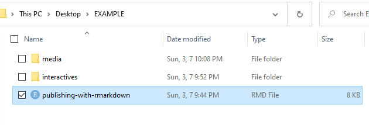
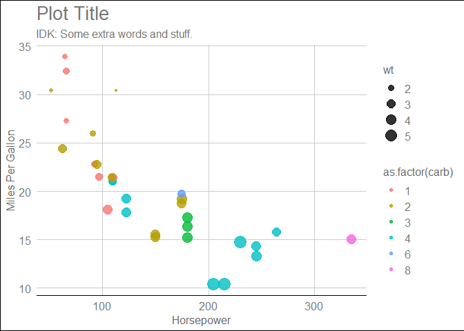
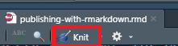
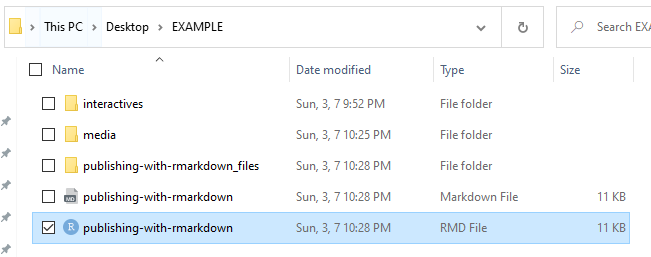
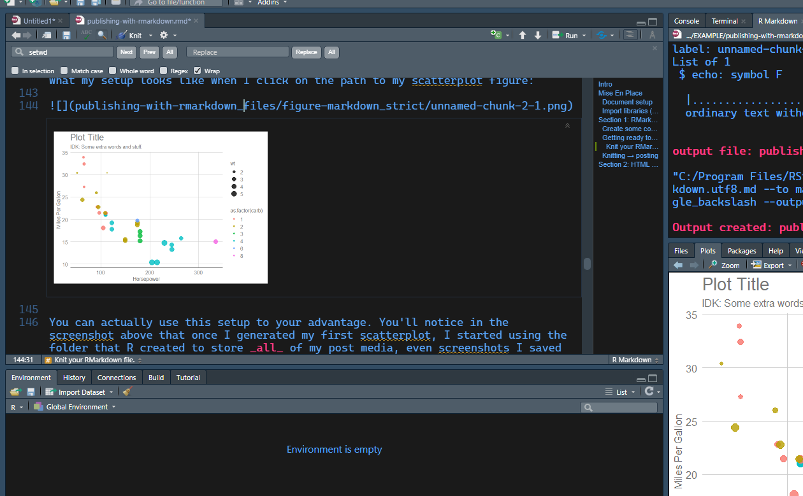
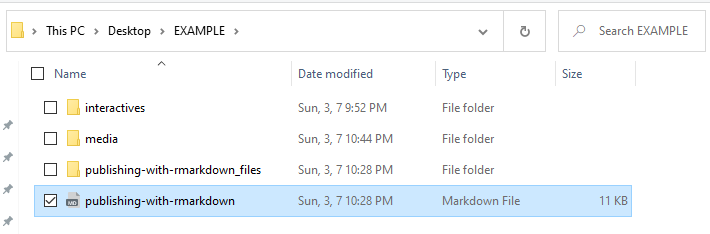
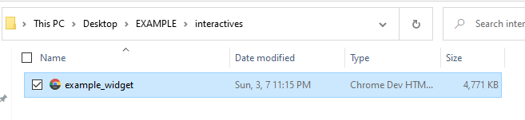
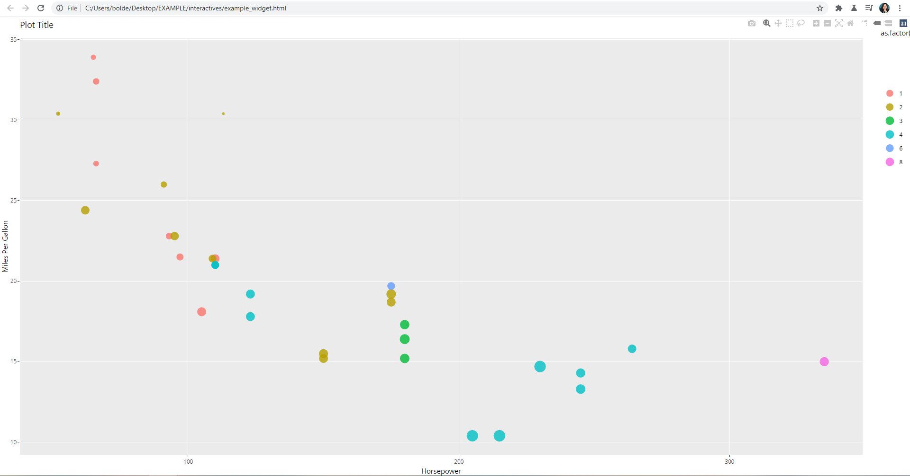

# Intro
This page explains how to publish RMarkdown content to the site. If
you’re only using static visuals in your RMarkdown file (e.g., PNG/JPG,
tables, code chunks), the publishing process is slightly more involved
than a regular markdown file, but manageable. If you want to include interactive visuals in your RMarkdown file (e.g.,
an HTMLWidgets viz), it’s *still* manageable. But it requires additional
exporting and importing of files to get RMarkdown, markdown, and HTML to
play nicely.

So:

**The first section here shows how to publish RMarkdown files with
*only* static viz.**

**The second section will pick up where the first section leaves off,
explaining how to also include interactive “widgets” in your post.**

This entire document is written in RMarkdown (to make sure what’s
explained here actually works, lmao). However, you can’t actually store
the RMarkdown file in the Github Pages repo, so I’ve saved a copy of the
file in our Google Drive here. If you download this file, you can
(hopefully) follow along to get a feel for how publishing works.

# Mise En Place

Until you’re ready to publish, plan to work on your .rmd outside of the
github pages repository. I recommend the following “base” setup for a
new RMarkdown-based site project (I’ve kept mine on my desktop until
it’s ready to publish).

-   your project’s “main” folder (mine shows up in example screenshots
    as “EXAMPLE”). I’ll call this your “post folder” and your “working
    directory” interchangeably.
-   a folder called “media,” for any screenshots or other images you’re
    including in your post that aren’t coming from R.
-   *optional*: A folder called “interactives,” if you plan to include
    HTML Widgets.

To open this folder in R — i.e., to set it as your working directory —
go to the top menu and click: *Session → Set Working Directory → Choose
Directory*. Select your equivalent of the `EXAMPLE` folder as your
working directory.

## Document setup

You’ll work with the .rmd file like you would almost any other. The key
differences are that you’ll include ftd-specific YAML at the start,
instead of the default YAML that R gives you. And you’ll add a couple of
extra lines that help knitr convert the .rmd into a.md file.

<mark>Here’s what the YAML for any RMarkdown post will look like:</mark>

    ---
    title: "Your Title"
    subtitle: "Post subtitle goes here."
    umbrella: "category"
    author: "firstname"
    image_path: "https://fakewebsite.com/image-path-example.png"
    image_alt: "Some example alt text."
    permalink: "projects/category/post-url-slug"
    output: 
      md_document:
        preserve_yaml: TRUE 
    ---

Once you’ve got your YAML in place, you can prepare your .rmd exactly
like you would any other RMarkdown file. It’s as you’re getting ready to
publish to the site that you’ll want to start looking through the
guide(s) below.

## Import libraries (for this page only)

I would use R’s built-in datasets to make example viz, but I genuinely
do not know how to use base R’s viz tools. So…I’ll lean on ggplot for
the static viz and ggplotly for the interactive examples, but there are
no “mandatory” libraries for RMarkdown pubs besides knitr/pandoc.

    ## 
    ## Attaching package: 'plotly'

    ## The following object is masked from 'package:ggplot2':
    ## 
    ##     last_plot

    ## The following object is masked from 'package:stats':
    ## 
    ##     filter

    ## The following object is masked from 'package:graphics':
    ## 
    ##     layout

# Section 1: RMarkdown post (static content only)

## Create some content

Pretend this is a paragraph that’s introducing/contextualizing the viz
that’s displayed below:

Here’s the underlying R code used to create the viz, which normally
doesn’t show up in the final output if `echo` is set to `FALSE`:

    ggplot(mtcars, aes(hp, mpg, size = wt, color=as.factor(carb))) +
      geom_point(alpha=.8) +
      theme_gdocs() +
      ggtitle(label = "Plot Title", subtitle = "IDK: Some extra words and stuff.") +
      xlab(label="Horsepower") +
      ylab(label="Miles Per Gallon")

You can imagine that if I were writing an analysis of some sort, I’d
have a few other types of viz alongside the example above I’m only going
to include the one scatterplot above in this section, but the steps for
publishing are *exactly the same* for posts with multiple pieces of
static viz. 

Like — legit, you’re just writing an RMarkdown post (provided there are
no HTML Widgets).

## Getting ready to publish

**Note:** If you want to test whether this process will work from your
end, you could DL the .rmd file, delete everything below this current
paragraph, and change the post’s permalink to something unique. From
there, if you follow the rest of the instructions in this section
(they’ll still be available here on the site), you’ll be able to see if
you can turn your own .rmd into a live test post!

### Knit your RMarkdown file.

RMarkdown (and regular markdown) is designed to be a less cumbersome way
of writing text that will be published in a specific language (e.g.,
HTML) or format (e.g., Word; PDF). In our case, the .rmd file has to be
“knitted” (translated) into HTML before our website can understand it.
But dealing with HTML f\*ckn sucks, and there’s no need to here: we’re
gonna knit (translate) the file into markdown, and from there, Jekyll
will translate it into HTML for us.

To do so, as long as you’ve got the YAML mentioned above, and all the
RMarkdown pre-reqs installed, you just click *knit*:

As soon as you click *knit*, two new files should appear in your working
directory: your markdown file, plus a separate folder that houses any
external files (such as images of any plots) that were generated in the
knitting process.

For example, when I knit this document to my desktop (nothing else below
this has been written at this point), I see the following output after
running *knit* for the first time:

If you open the `publishing-with-rmarkdown_files` folder (or your own
post’s equivalent), you’ll have to open *another* folder to get to the
actual figures that your .md file points to. My advice is to ignore your
equivalent of `_files` altogether. The folders and .md file are placed
in a way that they’ll know how to talk to each other.

That said, if you want to add other images besides the ones that are
prepares for you, read the next section!!

### Adding your own media (e.g., non-R images)

Since you created your own `interactives` and `media` folders at the
start, you can store your any additional media content there. Static
content, like images, will go in the `media` folder. (For example, all
of this post’s screenshots live in `media`.) As long as the file lives
in `media`, you can embed the image in your post by including the below
code in your .rmd file where you want the image to appear:

    

If you’re working from RStudio, you’ll know you did this correctly if
you see a preview of the image load when you click on your link. Here’s
a screenshot of what my setup looks like when I click on the path to my
scatterplot .png:

## Posting

**MAKE SURE TO DO THIS BEFORE YOU POST**

You **MUST** remvove the .rmd file from your post folder before you add
the post folder to github. You can store the .rmd on your own machine,
on google drive, in a github repo that’s separate from the github pages
repo. But if it ends up on the GH pages repo, it’ll appear live as a
really wonky-looking post alongside the correctly-formatted version.

Once you’ve knitted your .rmd and removed the .rmd file from your post
folder, its contents should look more-or-less like this:

The parent folder that you created should be placed in whichever
subdirectory on github pages is appropriate. As a concrete example, if
this page were hypothetically categorized as \#TheStruggle, I’d save my
parent folder (`EXAMPLE` in the screenshot above) in
root→projects→thestruggle.

If you upload your folder to the repo directly from github.com, you
should hopefully see your post appear at your permalink within a few
minutes. If you’re using git (or github desktop), you’ll need to push
the update before you begin the few-minute-wait.

In the next section, I’ll build on what I’ve described here by
explaining how to add interactive HTML Widgets to your RMarkdown posts.

# Section 2: HTML Widgets

If you made it through the previous section, I promise it’s actually not
that much more work!! But all of this can seem overwhelming at first, at
least until you’ve done it a couple of times. :( Hang in there! :)

In this section, we’re going to rewind and pretend we didn’t just post
our files to github. We’ll keep the post folder on our desktop, exactly
has we had it before we moved it to GH (this is because we’re going to
have to knit it again, and we need the .rmd for that).

The reason HTML Widgets are more involved is that knitr doesn’t know how
to translate HTML to markdown. The roundabout solution here is to export
the HTML widget separately; in doing so, knitr will never have to look
at it. and re-import it into the .md as an HTML.

Below, I’m including a code chunk that I ran **before** I knit this
document:

    example_widget <- ggplotly(ggplot(mtcars, aes(hp, mpg, size = wt, color=as.factor(carb))) +
      geom_point(alpha=.8) +
      ggtitle(label = "Plot Title", subtitle = "IDK: Some extra words and stuff.") +
      xlab(label="Horsepower") +
      ylab(label="Miles Per Gallon")) # create the viz object

    example_widget # display the viz in the RStudio console

If you run that code chunk in RStudio, your viewer will display the
equivalent of this visualization:

To get the interactive visualization you see above into an RMarkdown
doc, we need to **export the HTML widget**.

## Export the widget

In the example code above, the widget is stored as an object called
`example_widget`.

The code below is what exports the HTML widget. I’ve named my file
`example_widget.html`. The code snippet below shows what I ran in R to
save the widget (I manually moved the widget into `interactives` when it
saved into `EXAMPLES`). Again, you should run your equivalent of this
code **prior to knitting the .rmd file, and then remove it from the
.rmd. Your .rmd file should not know this code exists lmao.**

    saveWidget(example_widget, "example_widget.html", selfcontained = T)

If all has gone well, you’ll see your file appear in the `interactives`
folder:

And if you double-click the file, your browser should open and you
should see…well…a widget:

## Knit your file

As long as you’ve removed all your clandestine usage of HTML Widgets
from your .rmd file, you’re ready to knit it into a .md. You’ll knit it
using the exact same steps from the first section.

## Import your widgets into your .md

Here’s our biggest divergence from section 2. We’re now going to edit
the .md file before we upload the final document to github.

For this example, in my .md file, I include the follow line of code
where the interactive scatterplot appears above:

    
    
    

As long as your widget is stored in a subfolder of your post called
`interactives`, all you have to do is replace the line of code with your
own widget’s name where you want to include them in your post. And as
long as each widget has a unique name, you can include as many as you
want in a post.
